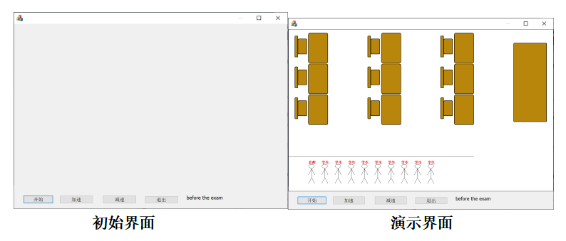

#### 考试系统

 考试开始前，所有学生和监考老师都在教室外等候，进入考场原则为先来先进，则对于进入考场的顺序需要各线程进行竞争。

​	考试结束后，离开考场原则为先来先出，各学生相关的线程对于离开考场的顺序再次进行竞争，教师在所有学生离开考场后最后一个离开考场。

   共需要10个线程，首先代表9个学生和教师的线程关于进入考场顺序进行竞争，其次代表各学生的线程关于离开考场的顺序进行竞争。

